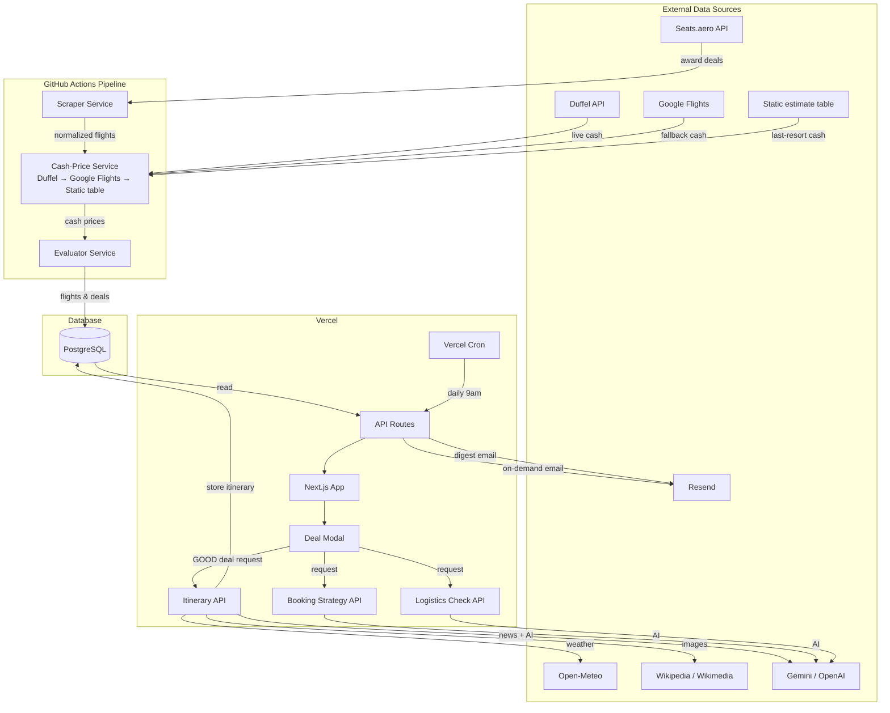
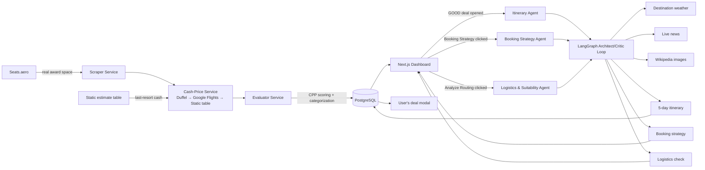

# Flight Deal Dashboard

**Live dashboard:** https://flight-deals-dashboard.vercel.app

A hybrid flight-deal discovery platform. A fast, deterministic data pipeline scrapes real award availability from the US to Asia, values every redemption against the cheapest live one-way cash alternative, and categorizes the deal by value. Heavy multi-agent LLM workflows are reserved for on-demand itinerary generation when a user opens the best redemptions.

This is a full-stack, data-intensive project built with Next.js, PostgreSQL, LangChain/LangGraph, and a continuous ingestion pipeline.

---

## What it does

The dashboard ingests real award-space data, applies a deterministic points-and-miles valuation framework, and presents the results through a fast, filterable UI.

### Two-level browsing

The interface is built around two views:

1. **Origin-city grid** — the home page shows every departure city as a card. Each card displays:
   - Total number of deals from that city.
   - A colored quality breakdown: GOOD, MAYBE, OKAY, and OTHER.
   - The lowest starting price in points or cash.
   - The categories are ordered GOOD → MAYBE → OKAY → OTHER so the best opportunities are visible at a glance.

2. **City detail page** (`/origin/[city]`) — every deal from the selected origin. A full filter bar lets users narrow by:
   - Category (GOOD / MAYBE / OKAY / OTHER)
   - Airline
   - Cabin (Economy, Premium Economy, Business, First)
   - Trip type (One Way / Round Trip)
   - Month, Year, and ISO Week
   - Sort by: **Deals** (GOOD first), **Points**, or **Date**

The deals load in batched, paginated sets so the page stays fast even with tens of thousands of records.

### Deal modal

Clicking a deal opens a detail modal with:

- Full route, airline, cabin, and date information.
- Points required and taxes/fees.
- A short rationale explaining why the deal is GOOD, MAYBE, OKAY, or OTHER.
- **Representative Cash Flight Details** — duration, stops, layover airport and duration, and the cash airline. These come from the cheapest one-way cash alternative for the same route, cabin, and date.
- A live booking link back to the award search on Seats.aero.
- A one-click email field to send the full itinerary.
- **Booking Strategy** and **Analyze Routing** on-demand agents (one click each) that generate a points transfer plan and a layover/cabin-product critique.

---

## How deal quality is scored

Every deal is evaluated using the standard points-and-miles metric **cents per point (CPP)**:

```
CPP = (Cash Price − Taxes & Fees) ÷ Points Required × 100
```

The thresholds are:

| Category | CPP threshold | What it means |
| --- | --- | --- |
| **GOOD** | ≥ 2.0¢ | Excellent redemption value. |
| **MAYBE** | ≥ 1.5¢ | Solid, close to great. |
| **OKAY** | ≥ 1.0¢ | Fair, but not exceptional. |
| **OTHER** | < 1.0¢ | Paying cash or waiting is usually better. |

A 2.0¢+ CPP is the widely accepted "great value" benchmark in the points-and-miles community. These thresholds are applied automatically to every scraped deal.

### Cash price logic

The **Cash Price** in the CPP formula is the cheapest one-way cash flight for the **same origin, destination, cabin, and departure date**. The system looks up this price in priority order:

1. **Duffel API** — live one-way offers.
2. **Google Flights** via `fast-flights-ts` — fallback live search.
3. **Static estimate table** — last-resort fallback if both live sources fail.

The live cash price is cached per `route/cabin/date` so the value reflects the specific departure date. If the cheapest cash option is on a different airline than the award flight, the modal still shows it as the representative market value, with clear wording that the actual award flight may differ in airline, timing, stops, or layover.

---

## On-demand AI itineraries

Full AI itineraries are **not** pre-generated for every deal — they are built when a user opens a **GOOD** deal. This keeps the pipeline fast and the API call costs under control.

The flow is:

1. The user clicks a GOOD deal.
2. If a full itinerary already exists in the database, it is returned instantly.
3. If not, the modal calls `POST /api/itinerary`, which runs the agentic generator:
   - Fetches a 5-day weather forecast from Open-Meteo.
   - Searches live destination news and events.
   - Retrieves a destination hero image and daily activity images. The LLM is required to emit a specific English landmark or activity name for each day (e.g. "Victoria Peak", "Tian Tan Buddha"), not the destination city, "skyline", or "flag". Each placeholder is resolved through Wikipedia and Wikimedia Commons; flag and emblem images are rejected, and the destination image is never used as the fallback for daily images.
   - Generates a 5-day, cabin-appropriate itinerary through a **LangGraph architect/critic loop**:
     - The **Architect** drafts the itinerary, weaving together weather, news, the booked airline/cabin, and the destination.
     - The **Critic** reviews the draft specifically for hallucinations that would mislead the traveler. It checks that the plan does not invent premium perks, direct routes, partner airlines, lounges, or upgrades that are not part of the actual booking.
     - If the Critic finds an issue, the loop sends the feedback back to the Architect, which produces a corrected draft. This continues until the Critic is satisfied.
   - Hydrates the itinerary with images and caches it in PostgreSQL.

Each itinerary includes a **reality check** that the airline, cabin, and routing match the booked award — no implied upgrades, partner re-routes, or premium-cabin services unless they are part of the actual booking.

---

## The autonomous pipeline

The data ingestion pipeline runs automatically every **5 hours** via **GitHub Actions** and is made up of three deterministic services:

1. **Scraper Service** — pulls real award space from the Seats.aero Partner API, searching up to **1 year out** and ingesting thousands of records per run. It normalizes airline, cabin, origin/destination, points, taxes, dates, and routing. This is a standard API-scraping and data-normalization script with no LLM reasoning.
2. **Cash-Price Service** — prefetches live one-way cash prices for every unique route/cabin/date through deterministic lookups. It tries the Duffel API first, falls back to Google Flights via `fast-flights-ts`, and uses a static estimate table only as a last resort. No generative model is involved.
3. **Evaluator Service** — runs the deterministic CPP guardrail to categorize every deal. It also uses a lightweight, single-turn LLM prompt for the first `MAX_AI_REASONING` top deals to write a short rationale string. The actual category comes from the math, not from the LLM.

The pipeline stores flights and deals in PostgreSQL via Drizzle ORM, and the Next.js frontend reads from there.

### On-demand & serverless agents

The multi-agent, LLM-driven parts of the system run on **Vercel**, not in the GitHub Actions pipeline:

- **Itinerary Agent** — triggered on demand when a user opens a `GOOD` deal and the modal calls `POST /api/itinerary`. It combines weather, news, images, and a LangGraph architect/critic loop into a polished Markdown itinerary.
- **Booking Strategy Agent** — triggered on demand when the user clicks **"Booking Strategy"** in the deal modal and calls `POST /api/booking-strategy`. It identifies transferable points programs, transfer times, and a step-by-step plan to book the award before it disappears.
- **Logistics & Suitability Agent (Critic)** — triggered on demand when the user clicks **"Analyze Routing"** in the deal modal and calls `POST /api/logistics-check`. It reviews the route, layovers, aircraft, and cabin product to flag risky connections or outdated premium seats.
- **Email Agent** — converts the Markdown itinerary to HTML and delivers it through Resend. It runs on demand via `POST /api/email-itinerary` or automatically once a day as a **Vercel Cron** job hitting `GET /api/cron/email-deals`.

---

## Architecture & workflow

> If the diagrams below do not render, view this README on GitHub — it supports native Mermaid rendering.

### Overall app architecture



### Agent workflow



---

## Key design decisions

- **Date-specific cash pricing** — cash prices are cached by `route/cabin/date` instead of `route/cabin`, so CPP reflects the actual departure date.
- **Cheapest-cash fallback** — if the award airline is not available in live cash results, the system falls back to the cheapest cash option for that route and date rather than returning null and using a low static estimate.
- **On-demand heavy AI** — itineraries, news, weather, and image generation happen only when a GOOD deal is opened, keeping the 5-hour pipeline lightweight.
- **Multi-source itinerary images** — each `![IMAGE: ...]` placeholder is resolved through Wikipedia and Wikimedia Commons. The architect is instructed to use specific English landmark/activity names; the critic rejects generic terms, flags, or skyline-only placeholders. Flag, emblem, and coat-of-arms images are filtered out at the source, and the destination image is not reused as a daily fallback.
- **Responsive mobile UX** — the modal uses a proper viewport meta tag, full dynamic viewport height, bottom-safe padding, and `overflow-x-hidden` so the page never requires horizontal panning. Inputs use a 16px font size to prevent iOS zoom.
- **Batch pagination** — city pages preload 200 deals at a time and render 20 per page, balancing speed and memory on the serverless backend.
- **Serverless deployment** — the entire app runs on Vercel with dynamic API routes, while the heavy data pipeline runs in GitHub Actions.

---

## Data sources

- **Seats.aero API** — real mileage-program award space.
- **Duffel API** — live one-way cash offers.
- **fast-flights-ts / Google Flights** — fallback cash price lookup.
- **Open-Meteo** — 5-day destination weather.
- **Wikipedia / Wikimedia** — destination hero images and daily landmark/activity images (Wikipedia page summary + Wikimedia Commons search).
- **Gemini or OpenAI (via LangChain)** — live destination news search and AI itinerary generation.
- **Resend** — transactional and digest email delivery.

---

## Tech stack

- **Frontend**: Next.js 14 App Router, React, TypeScript, Tailwind CSS, SWR
- **Backend API**: Next.js Route Handlers, Vercel serverless functions
- **Database**: PostgreSQL + Drizzle ORM
- **AI & multi-agent**: LangChain + LangGraph, Gemini or OpenAI
- **Cash pricing**: Duffel API, fast-flights-ts (Google Flights)
- **Email**: Resend, `marked` for Markdown → HTML
- **Automation**: GitHub Actions every 5 hours for the data pipeline; Vercel Cron for the daily email digest
- **Deployment**: Vercel

---

## API surface

The dashboard is backed by a set of JSON API routes:

- `GET /api/origins` — origin cities with total counts and category breakdowns.
- `GET /api/deals` — paginated, filterable deals.
- `GET /api/filter-options` — available airlines, cabins, categories, months, years, and weeks.
- `POST /api/itinerary` — generate and return the AI itinerary for a GOOD deal.
- `POST /api/booking-strategy` — generate transferable-points and booking plan for a deal.
- `POST /api/logistics-check` — analyze the route, layovers, and cabin product for a deal.
- `POST /api/email-itinerary` — email a specific deal and itinerary to a user.
- `GET /api/cron/email-deals` — daily digest trigger for Vercel cron.

---

## Highlights

- Built an **end-to-end autonomous data pipeline** that scrapes, values, categorizes, and stores **100k++ real award deals** across **12 US origin cities**, with award space searched up to **1 year** into the future.
- Implemented a **CPP-based valuation guardrail** that automatically categorizes every deal — using the standard points-and-miles benchmark.
- Designed a **date-specific live cash price cache** that values each redemption against the cheapest real-world one-way cash alternative for the exact route, cabin, and departure date.
- Integrated a **LangGraph architect/critic AI loop** for on-demand, multi-source itinerary generation (weather, news, Wikipedia/Wikimedia landmark images, AI plan) only for GOOD deals, plus on-demand Booking Strategy and Logistics & Suitability agents. Added explicit critic guardrails and source filters so itineraries avoid generic skyline/flag images and each day shows a distinct landmark.
- Built a **two-level, filterable Next.js dashboard** that serves 20 deals per page and preloads them in 200-deal batches for fast, serverless pagination.
- Automated the data pipeline with **GitHub Actions** (running every 5 hours), the daily email digest with **Vercel Cron**, and deployed the dashboard to **Vercel** with a custom domain.


