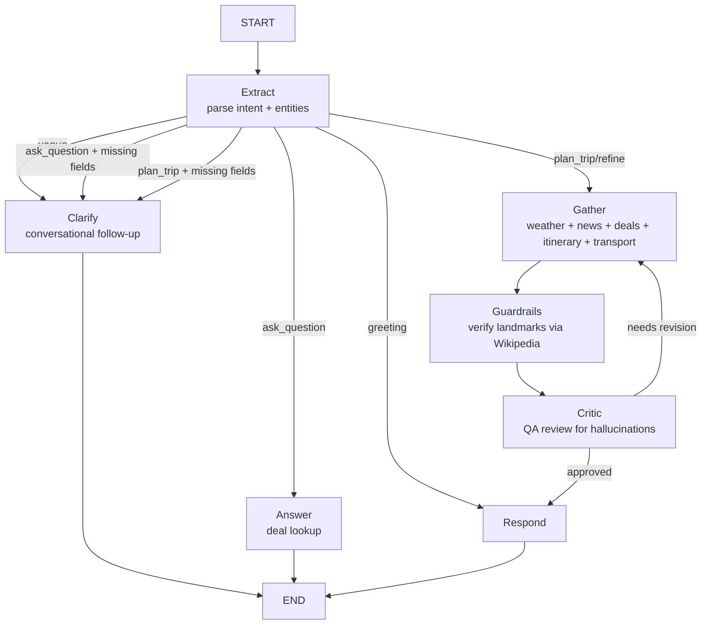

# Jalan — Conversational Travel Itinerary Planner

**Live app:** https://jalan-ai.vercel.app

A conversational travel planning assistant that turns natural-language requests into full day-by-day itineraries with live weather, real points flight deals, transport routing, packing lists, daily Google Maps route links, and hallucination guardrails — all powered by a LangGraph multi-agent loop with a hybrid Gemini model configuration.

_"jalan" means "to walk" or "to travel" in Indonesian._

Built with Next.js 14, LangChain/LangGraph, PostgreSQL, Clerk auth, the Seats.aero Partner API, OSRM (Open Source Routing Machine), and Nominatim geocoding.

---

## What it does

Users chat with **Jalan**, a friendly travel companion that:

1. **Understands natural-language trip requests** — e.g. *"Tokyo in October"*, *"honeymoon in Thailand"*, *"Paris for a week"*, *"find any deal to Bangkok in January"*.
2. **Asks clarifying questions** when details are missing — dates, origin, budget, cabin, trip length. Handles vague messages gracefully with conversational follow-ups.
3. **Generates a full day-by-day itinerary** with:
   - Real weather forecast from Open-Meteo.
   - Live destination news and events (Gemini web search grounding).
   - Landmark images for each day from 4 image sources (Wikimedia Commons, Wikipedia, Openverse, Pexels) — deduplicated, with destination image fallback so every day has an image.
   - A "Getting Around" section with local transit tips.
   - Per-day transport notes (walking/transit guidance).
4. **Plans transport between every stop** — a dedicated transport agent geocodes each landmark and uses OSRM to get real walking/driving times, then recommends the best mode (walk, transit, ride-share) per leg, plus city-specific transit tips and cost estimates. Handles generic transit terms (MTR, Subway, JR) intelligently.
5. **Searches live award flight deals** via the Seats.aero Partner API — returns the top 5 lowest-mileage options, diversified by origin city, with duration, stops, taxes, and direct airline booking links.
6. **Provides daily Google Maps route links** — each day's landmarks are turned into a clickable Google Maps directions URL with highlight summaries (e.g. "Louvre → Eiffel Tower → Montmartre").
7. **Suggests a packing list** based on destination and weather.
8. **Lets users save trips** to a **One Stop** panel (sign-in gated) with to-dos, notes, deals, itinerary, routes, transport, and packing list.
9. **Provides a section navigator** — a slim right-side rail (desktop) and floating button + drawer (mobile) that lets users jump to any section of the itinerary (Weather, Transport, Packing, Deals, Routes, individual days).

---

## Architecture

### Hybrid model configuration

The app uses a **hybrid Gemini model configuration** to balance quality and cost:

| Node | Model | Why |
|------|-------|-----|
| **generateItinerary** | `gemini-3.5-flash` | Main content — quality matters most (better prose, fewer hallucinations, near-perfect image placeholder compliance) |
| **criticNode** | `gemini-3.5-flash` | Quality evaluation — needs strong reasoning to catch hallucinations |
| extractNode | `gemini-3.5-flash-lite` | Quick JSON entity extraction (~1s) |
| clarifyNode | `gemini-3.5-flash-lite` | Quick follow-up question (~1s) |
| answerNode | `gemini-3.5-flash-lite` | Quick factual answers (~1s) |
| generatePackingTips | `gemini-3.5-flash-lite` | Short list (~1s) |
| generateTitle | `gemini-3.5-flash-lite` | Quick title (~1s) |

Configurable via `CHAT_MODEL` (speed) and `QUALITY_MODEL` (quality) env vars. Cost: ~$15-20 per 1,000 trips.

### LangGraph conversation pipeline

The chat backend is a LangGraph state machine with the following nodes:



- **Extract** — uses `chrono-node` + LLM to parse destination, dates, duration, cabin, travelers, budget, and intent (`plan_trip`, `ask_question`, `refine`, `greeting`, `vague`) from the user's message. Enforces a 30-day duration cap.
- **Clarify** — asks follow-up questions for missing required fields (destination, dates). For vague messages, generates a warm, conversational follow-up with example ideas.
- **Gather** — fetches weather (Open-Meteo), news (Gemini web search), live deals (Seats.aero), destination image, generates the itinerary and packing list in parallel, then builds route links and the transport plan.
- **Guardrails** — extracts every landmark from the itinerary and verifies each one exists on Wikipedia. Flags any unverified places as potential hallucinations. Auto-rejects if image placeholders are missing.
- **Critic** — a strict QA reviewer that checks for hallucinated flights, fake attractions, invented transit lines, missing weather, inconsistent day counts, and unverified landmarks. Sends feedback back to the gather node if the itinerary needs revision (up to 2 revisions, or 3 for missing image placeholders).
- **Respond** — hydrates image placeholders with real image URLs from 4 sources (deduplicated), assembles the final markdown response.
- **Answer** — handles deal-only lookups (e.g. *"find deals to Tokyo in December"*) with live Seats.aero search.

### Transport agent

After the itinerary is generated and route links are extracted, a dedicated transport agent (`src/agents/transport.ts`) runs to provide real-world transport guidance:

1. **Geocodes each landmark** via Nominatim (OpenStreetMap, free, no API key).
2. **Gets real walking and driving times** between consecutive stops via OSRM (free, no API key).
3. **Recommends the best transport mode per leg** based on distance:
   - Under 15 min walk → "Walk"
   - 15-25 min walk → "Walk" (if driving would be 8+ min due to traffic)
   - Short drive but long walk → "Transit/Ride-share"
   - Over 5km → "Transit/Ride-share"
   - Otherwise → "Transit" with a balanced note
4. **Handles generic transit terms** — when the LLM uses terms like "MTR", "Subway", "JR", "Train" as stop names, the agent recognizes them and labels the leg as a transit ride (with the appropriate mode emoji) instead of trying to geocode them as walkable destinations.
5. **Generates city-specific transit tips** via LLM — which transit pass/card to buy, best navigation/ride-share app, cultural tips, and when to walk vs. take transit.
6. **Estimates transport costs** — markdown table with day pass, single ride, taxi base fare, ride-share, and weekly total.

Processes all days (batched 3 at a time) to respect Nominatim's 1 req/sec rate limit.

### Image hydration

The image agent (`src/agents/destination-images.ts`) tries 4 sources in order for every landmark:

1. **Wikimedia Commons** — public domain / CC images
2. **Wikipedia article lead image** — for famous landmarks (handles non-English names via redirects)
3. **Openverse** — free, no API key — millions of CC images from Flickr, Wikimedia, Rawpixel, etc.
4. **Pexels** — free stock photos (optional, requires `PEXELS_API_KEY`)

Features:
- **Deduplication** — tracks used URLs and tries alternative search terms to find unique images per day.
- **Destination image fallback** — pre-fetches the destination city image and uses it as a last resort so every day always has an image.
- **Aggressive fallback terms** — for each landmark, tries city + landmark + photo/night/skyline/street/district variants.
- **Placeholder injection** — if the LLM forgot to include `![IMAGE: ...]` for some days, the agent inserts one using the first bold landmark in that day's block.

### Live deal search (Seats.aero)

When the agent needs flight deals:

1. Searches the local PostgreSQL cache first.
2. If no cached deals match, calls the Seats.aero Partner API live:
   - Searches across major US gateways (JFK, LAX, SFO, ORD, DFW, etc.) if no origin is specified.
   - Returns up to 100 candidates, sorted by lowest mileage.
   - **Diversifies by origin city** — uses round-robin selection across unique origins so deals come from different hubs, not all from the same city.
   - Enriches the top 5 with trip details (duration, stops, layover, aircraft) from the Seats.aero `/trips/{id}` endpoint.
3. Each deal includes a direct booking link to the airline's website (Delta, American, United, JAL, etc.) via `src/lib/airline-booking.ts`.

### Hallucination guardrails

- **Wikipedia landmark verification** — every `![IMAGE: ...]` placeholder in the itinerary is checked against Wikipedia's search API. Unverified landmarks are flagged.
- **Critic prompt** — explicitly checks for invented attractions, closed venues, fake transit lines, made-up schedules, and inconsistent day counts.
- **Itinerary generator prompt** — instructed to only include real, well-known attractions and to use specific station names (e.g. "Tsim Sha Tsui MTR Station" not "MTR").
- **Route link filtering** — the Google Maps route builder filters out generic words (morning, afternoon, hotel) and transit-mode names so only real places become waypoints.
- **Image deduplication** — the image hydration agent tracks used URLs and tries alternatives before falling back to the destination image.
- **30-day duration cap** — prevents absurd requests like "2 years" from generating 730+ day itineraries. The cap is enforced in extractNode, generateItinerary, and the prompt tells the LLM to mention it naturally in the intro.

### Global destination support

The agent works for any destination worldwide — not just a fixed set of cities. Lookup tables (`AIRPORT_NAMES`, `CITY_MAP`, `WEATHER_CITIES`, `WIKIPEDIA_CITIES`, `CITY_AIRPORTS`) cover 70+ global destinations across Asia, Europe, Middle East, Latin America, Oceania, and Africa. For destinations not in the lookup tables, the agent falls back to using the city name directly for weather geocoding (Open-Meteo), news search (Gemini), and image lookups.

### One Stop panel

A sign-in-gated, centered modal accessible from the left sidebar that lets users:

- **Save** any assistant response (deals, itinerary, packing list, route links, transport plan).
- **View saved trips** organized by destination and dates.
- **Manage to-dos** — add, check off, and delete tasks per trip.
- **Write notes** — free-form notes per trip.
- **Copy trip summary** — copies everything to clipboard.
- **Persist locally** — saved trips are stored in `localStorage`.

---

## Tech stack

- **Frontend**: Next.js 14 App Router, React, TypeScript, Tailwind CSS, SWR, Clerk auth
- **Backend**: Next.js Route Handlers (Node runtime), Vercel serverless functions
- **AI**: LangChain + LangGraph, Google Gemini (hybrid: `gemini-3.5-flash` for quality, `gemini-3.5-flash-lite` for speed)
- **Flight deals**: Seats.aero Partner API (live search + trip details)
- **Transport routing**: OSRM (free walking/driving times) + Nominatim (geocoding)
- **Weather**: Open-Meteo (forecast + long-range climate projections)
- **Images**: Wikimedia Commons + Wikipedia + Openverse + Pexels (optional, 4 sources, deduplicated)
- **News**: Google Gemini web search grounding
- **Date parsing**: chrono-node
- **Database**: PostgreSQL + Drizzle ORM (for cached deals and conversation history)
- **Auth**: Clerk (sign-in/sign-up, anonymous sessions)
- **Deployment**: Vercel

---

## Key features

### Conversational chat
- Natural-language trip planning with follow-up questions.
- Vague message handling — asks warm, conversational follow-ups with example ideas.
- Context-aware loading statuses (e.g. *"Checking the weather..."*, *"Looking for deals..."*).
- Conversation history with dynamic titles and delete.
- Persistent conversations across sessions (for signed-in users).
- Gemini-style sidebar with New trip, One Stop, and recent conversations.
- Closable sign-in prompt that appears when a guest sends their first message.

### Live flight deals
- Top 5 lowest-mileage award deals from Seats.aero.
- **Diversified by origin city** — round-robin selection across multiple US gateways when no origin is specified.
- Each deal shows: origin → destination, airline, cabin, date, points, taxes, duration, stops.
- Clickable cards that link directly to the airline's booking page.

### Transport & getting around
- **Live routing** — real walking and driving times between every itinerary stop via OSRM.
- **Best mode per leg** — recommends walk, transit, or ride-share based on actual distance.
- **Generic transit term handling** — recognizes MTR, Subway, JR, Train, Bus, Tram, Ferry, Taxi and labels them as transit legs instead of trying to geocode them.
- **City transit tips** — which pass/card to buy, best apps, cultural tips (AI-generated).
- **Cost estimates** — day pass, single ride, taxi, ride-share, and weekly total.
- Green-themed card in the chat with transit tips and cost estimates.

### Daily route links
- Each day's landmarks are extracted and turned into a Google Maps directions URL.
- **Highlight summaries** — shows the key stops (e.g. "Louvre → Eiffel Tower → Montmartre").
- Clickable "Daily Routes" card in the chat.

### Section navigator
- **Desktop**: slim right-side rail listing all itinerary sections (days, weather, transport, packing, deals, routes).
- **Mobile**: floating button (bottom-right) opens a slide-out drawer with the same section list.
- Click any section to jump directly to it.

### Guardrails
- Wikipedia landmark verification.
- Critic checks for hallucinations, fake transit, inconsistent days.
- Route builder filters out non-place words.
- Image deduplication prevents repeated images.
- 30-day duration cap prevents absurd requests.

### One Stop panel
- Sign-in-gated centered modal (95vw x 90vh).
- Save deals, itinerary, packing list, transport plan, and routes.
- To-do list and notes per trip.
- Copy-to-clipboard trip summary.
- localStorage persistence.

### Mobile-optimized
- No horizontal scroll — all content fits within the viewport.
- Images and tables scroll within their containers, not the page.
- Auto-scroll to top when itinerary finishes generating.
- Responsive layout with mobile sidebar drawer.

---

## API surface

- `POST /api/chat` — streaming chat endpoint (SSE) that runs the LangGraph conversation pipeline.
- `GET /api/chat/conversations` — list saved conversations for the current user.
- `DELETE /api/chat/conversations/[id]` — delete a conversation.
- `GET /api/chat/history` — load message history for a conversation.
- `POST /api/chat/merge-session` — merge anonymous session into user account on sign-in.
- `GET /api/deals` — paginated cached deals (legacy dashboard support).
- `POST /api/itinerary` — on-demand itinerary generation (legacy).
- `POST /api/booking-strategy` — booking strategy agent (legacy).
- `POST /api/logistics-check` — logistics check agent (legacy).
- `POST /api/email-itinerary` — email itinerary (legacy).
- `GET /api/cron/email-deals` — daily digest cron (legacy).

---

## Data sources

- **Seats.aero Partner API** — real award availability, trip details (duration, stops, aircraft).
- **OSRM** — real walking and driving routes between landmarks (free, no API key).
- **Nominatim / OpenStreetMap** — geocoding of landmark names to coordinates (free, no API key).
- **Open-Meteo** — destination weather forecast + long-range climate projections.
- **Wikimedia Commons** — public domain / CC landmark images (deduplicated).
- **Wikipedia** — landmark verification + article lead images (handles non-English names).
- **Openverse** — free CC images from Flickr, Wikimedia, Rawpixel, etc. (no API key).
- **Pexels** — free stock photos (optional, requires `PEXELS_API_KEY`).
- **Google Maps** — daily route directions links (no API key required, uses public URL format).
- **Google Gemini** (via LangChain) — chat, itinerary generation, transport tips, critic, and reasoning.
- **Clerk** — authentication and user management.

---

## Project structure

```
src/
  agents/
    conversation-graph.ts    # LangGraph state machine (extract → clarify → gather → guardrails → critic → respond)
    itinerary-guardrails.ts  # Wikipedia landmark verification + Google Maps route link builder
    transport.ts             # Transport agent: OSRM routing + Nominatim geocoding + LLM transit tips
    destination-images.ts    # Image hydration: Wikimedia + Wikipedia + Openverse + Pexels (deduplicated)
    weather.ts               # Open-Meteo forecast + climate projections
    news-search.ts           # Destination news search (Gemini web search grounding)
    graph.ts                 # Itinerary graph for deal modal (architect → critic)
    ...
  lib/
    seatsaero.ts             # Seats.aero live search + trip details + deal diversification
    airline-booking.ts       # Airline-specific booking URL builder
    chat-state.ts            # Shared types (ChatPayload, SavedTrip, RouteLink, TransportPlan, etc.)
    chat-db.ts               # Conversation persistence
    ai-provider.ts           # LLM model configuration (hybrid: speed + quality models)
    airports.ts              # Airport code/name mappings (70+ global destinations)
    city-map.ts              # IATA → city/country mappings (70+ entries for news search)
    airlines.ts              # Airline code → name/description mappings
    ...
  components/
    chat/
      ChatPage.tsx           # Main chat UI with sidebar, messages, section navigator, One Stop panel
      OneStopPanel.tsx       # Sign-in-gated modal for saved trips, to-dos, notes
    SplashRedirect.tsx       # Redirects old domain to jalan-ai.vercel.app
    WalkersIcon.tsx          # Custom walking figure logo
    AuthProvider.tsx         # Clerk provider wrapper
  app/
    api/
      chat/route.ts          # Streaming chat endpoint (SSE)
      chat/conversations/    # Conversation CRUD
      chat/history/          # Message history
      ...
scripts/
  smoke-test.ts              # Post-deploy smoke tests (31 tests: deals, logistics, itinerary, chat endpoint)
```

---

## Setup

1. **Install dependencies:**
   ```bash
   npm install
   ```

2. **Configure environment variables** (see `.env.example`):
   - `GEMINI_API_KEY` — Gemini API key for LLM + news search grounding.
   - `SEATS_AERO_API_KEY` — Seats.aero Partner API key.
   - `DATABASE_URL` — PostgreSQL connection string.
   - `NEXT_PUBLIC_CLERK_PUBLISHABLE_KEY` + `CLERK_SECRET_KEY` — Clerk auth keys.
   - `CHAT_MODEL` — optional, defaults to `gemini-3.5-flash-lite` (speed-critical nodes).
   - `QUALITY_MODEL` — optional, defaults to `gemini-3.5-flash` (quality-critical nodes).
   - `PEXELS_API_KEY` — optional, enables Pexels as a 4th image source.

3. **Run the database migration:**
   ```bash
   npm run db:push
   ```

4. **Start the dev server:**
   ```bash
   npm run dev
   ```

5. **Build for production:**
   ```bash
   npm run build
   ```

6. **Deploy to Vercel:**
   ```bash
   npx vercel --prod
   npx vercel alias <deployment-url> jalan-ai.vercel.app
   npx vercel alias <deployment-url> flight-deals-dashboard.vercel.app
   ```

7. **Run smoke tests** (post-deploy):
   ```bash
   SMOKE_TEST_URL=https://jalan-ai.vercel.app npx tsx scripts/smoke-test.ts
   ```
   31 tests verifying: deals with real airline info, logistics check, itinerary with images + day headings, no duplicate deals section, no tweak prompt in markdown, chat route links, diversified deals by origin, transport plans, image uniqueness, and destination images.

---

## Highlights

- Built a **conversational travel planner** powered by a LangGraph multi-agent loop (extract → clarify → gather → guardrails → critic → respond) that turns natural-language requests into full itineraries.
- Configured a **hybrid Gemini model setup** — `gemini-3.5-flash` for quality-critical nodes (itinerary generation, critic) and `gemini-3.5-flash-lite` for speed-critical nodes (extraction, clarification, answers) — balancing quality and cost (~$15-20 per 1,000 trips).
- Added a **transport agent** that geocodes every itinerary stop via Nominatim, gets real walking/driving times via OSRM, recommends the best transport mode per leg, handles generic transit terms (MTR, JR, Subway), and generates city-specific transit tips + cost estimates via LLM.
- Integrated **live Seats.aero award deal search** with trip-detail enrichment (duration, stops, aircraft), direct airline booking links, and **deal diversification by origin city** (round-robin selection across US gateways).
- Added **hallucination guardrails** that verify every itinerary landmark against Wikipedia and flag unverified places for the critic to reject.
- Implemented **daily Google Maps route links** with highlight summaries by extracting landmarks from the itinerary and building clickable directions URLs — no API key required.
- Built a **4-source image hydration agent** (Wikimedia Commons, Wikipedia, Openverse, Pexels) with deduplication and destination image fallback so every day always has an image.
- Added a **30-day duration guardrail** that caps absurd requests (e.g. "2 years") at 30 days, enforced in 3 places (extract, generate, prompt).
- Supports **70+ global destinations** with fallback to city name for weather, news, and images when IATA codes aren't in the lookup tables.
- Built a **Gemini-style sidebar** with New trip, One Stop, and recent conversations as nav items, plus a closable sign-in prompt for guests.
- Built a **One Stop panel** (sign-in-gated modal) for users to save deals, itineraries, transport plans, packing lists, routes, to-dos, and notes per trip.
- Integrated **Clerk authentication** with anonymous session merging and sign-in-gated features.
- Added **vague message handling** — when users send unclear messages, the agent asks warm, conversational follow-ups with example trip ideas.
- Used **chrono-node** for flexible natural-language date parsing (e.g. *"in two weeks"*, *"next October"*, *"2 week trip"*).
- Optimized **mobile experience** — no horizontal scroll, auto-scroll to top on itinerary completion, responsive layout with mobile sidebar drawer.
- Implemented **post-deploy smoke tests** (31 tests) that verify deals, logistics, itinerary quality, route links, deal diversification, image uniqueness, transport plans, and chat endpoint behavior.
