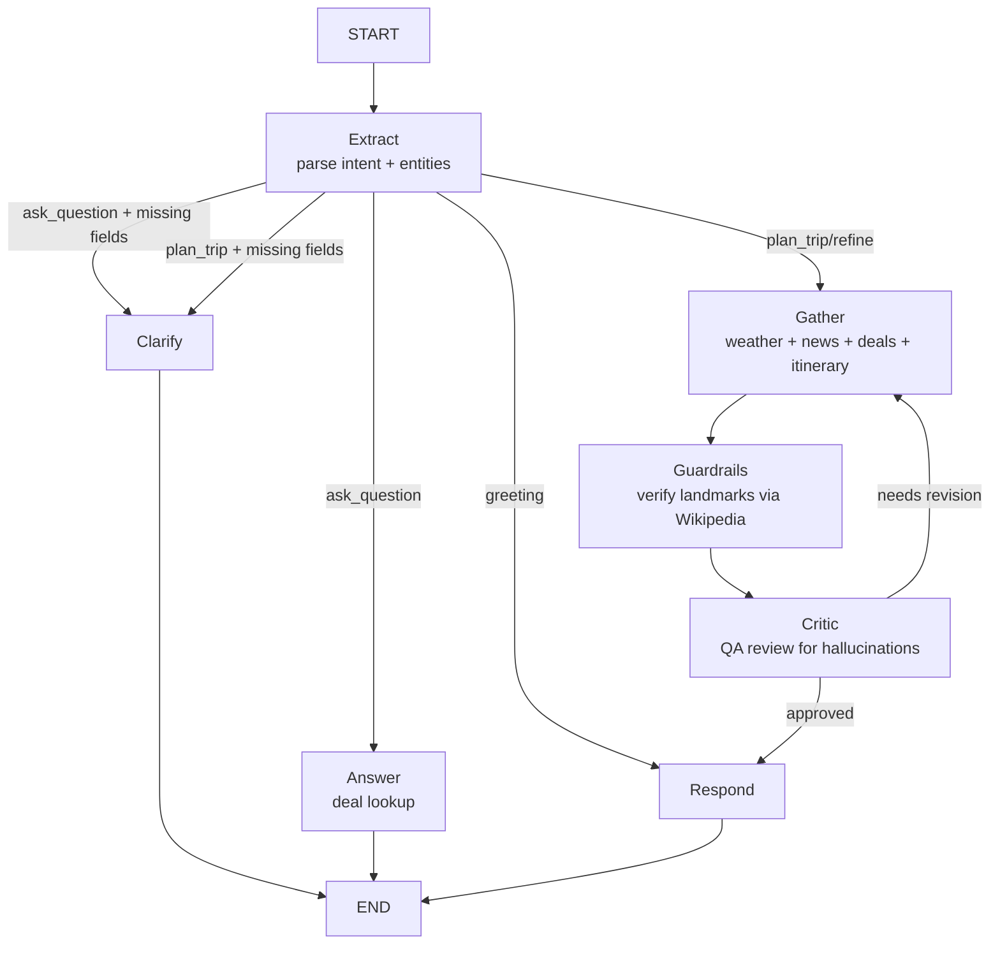

# Jalan AI — Conversational Travel Itinerary Planner

**Live app:** https://jalan-ai.vercel.app

A conversational travel planning assistant that turns natural-language requests into full day-by-day itineraries with live weather, real points flight deals, packing lists, daily Google Maps route links, and hallucination guardrails — all powered by a LangGraph multi-agent loop.

_"jalan" means "to walk" or "to travel" in Indonesian._

Built with Next.js 14, LangChain/LangGraph, PostgreSQL, Clerk auth, and the Seats.aero Partner API.

---

## What it does

Users chat with **Jalan AI**, a friendly travel companion that:

1. **Understands natural-language trip requests** — e.g. *"Tokyo in October"*, *"honeymoon in Thailand"*, *"find any deal to Bangkok in January"*.
2. **Asks clarifying questions** when details are missing — dates, origin, budget, cabin, trip length.
3. **Generates a full day-by-day itinerary** with:
   - Real weather forecast from Open-Meteo.
   - Live destination news and events.
   - Wikipedia/Wikimedia landmark images for each day.
   - A "Getting Around" section with local transit tips.
   - Per-day transport notes (walking/transit guidance).
4. **Searches live award flight deals** via the Seats.aero Partner API — returns the top 5 lowest-mileage options with duration, stops, taxes, and direct airline booking links.
5. **Provides daily Google Maps route links** — each day's landmarks are turned into a clickable Google Maps directions URL.
6. **Suggests a packing list** based on destination and weather.
7. **Lets users save trips** to a **One Stop** panel with to-dos, notes, deals, itinerary, routes, and packing list.

---

## Architecture

### LangGraph conversation pipeline

The chat backend is a LangGraph state machine with the following nodes:



- **Extract** — uses `chrono-node` + LLM to parse destination, dates, duration, cabin, travelers, budget, and intent from the user's message.
- **Clarify** — asks follow-up questions for missing required fields (destination, dates).
- **Gather** — fetches weather (Open-Meteo), news, live deals (Seats.aero), destination image, generates the itinerary and packing list in parallel.
- **Guardrails** — extracts every landmark from the itinerary and verifies each one exists on Wikipedia. Flags any unverified places as potential hallucinations.
- **Critic** — a strict QA reviewer that checks for hallucinated flights, fake attractions, invented transit lines, missing weather, inconsistent day counts, and unverified landmarks. Sends feedback back to the gather node if the itinerary needs revision (up to 2 revisions).
- **Respond** — hydrates image placeholders with real Wikimedia URLs, assembles the final markdown response with deals, weather, packing tips, and route links.
- **Answer** — handles deal-only lookups (e.g. *"find deals to Tokyo in December"*) with live Seats.aero search.

### Live deal search (Seats.aero)

When the agent needs flight deals:

1. Searches the local PostgreSQL cache first.
2. If no cached deals match, calls the Seats.aero Partner API live:
   - Searches across major US gateways (JFK, LAX, SFO, ORD, DFW, etc.) if no origin is specified.
   - Returns up to 100 candidates, sorted by lowest mileage.
   - Enriches the top 5 with trip details (duration, stops, layover, aircraft) from the Seats.aero `/trips/{id}` endpoint.
3. Each deal includes a direct booking link to the airline's website (Delta, American, United, JAL, etc.) via `src/lib/airline-booking.ts`.

### Hallucination guardrails

- **Wikipedia landmark verification** — every `![IMAGE: ...]` placeholder in the itinerary is checked against Wikipedia's search API. Unverified landmarks are flagged.
- **Critic prompt** — explicitly checks for invented attractions, closed venues, fake transit lines, made-up schedules, and inconsistent day counts.
- **Itinerary generator prompt** — instructed to only include real, well-known attractions and to not invent transit lines, schedules, or booking details.
- **Route link filtering** — the Google Maps route builder filters out generic words (morning, afternoon, hotel) and transit-mode names (JR Yamanote Line, Tokyo Metro) so only real places become waypoints.

### One Stop panel

A slide-out panel accessible from the top-right of the chat that lets users:

- **Save** any assistant response (deals, itinerary, packing list, route links).
- **View saved trips** organized by destination and dates.
- **Manage to-dos** — add, check off, and delete tasks per trip.
- **Write notes** — free-form notes per trip.
- **Copy trip summary** — copies everything to clipboard.
- **Persist locally** — saved trips are stored in `localStorage`.

---

## Tech stack

- **Frontend**: Next.js 14 App Router, React, TypeScript, Tailwind CSS, SWR, Clerk auth
- **Backend**: Next.js Route Handlers (Node runtime), Vercel serverless functions
- **AI**: LangChain + LangGraph, Google Gemini (chat + reasoning models)
- **Flight deals**: Seats.aero Partner API (live search + trip details)
- **Weather**: Open-Meteo
- **Images**: Wikipedia + Wikimedia Commons
- **Date parsing**: chrono-node
- **Database**: PostgreSQL + Drizzle ORM (for cached deals and conversation history)
- **Auth**: Clerk (sign-in/sign-up, anonymous sessions)
- **Deployment**: Vercel

---

## Key features

### Conversational chat
- Natural-language trip planning with follow-up questions.
- Context-aware loading statuses (e.g. *"Checking the weather..."*, *"Looking for deals..."*).
- Conversation history with dynamic titles and delete.
- Persistent conversations across sessions (for signed-in users).

### Live flight deals
- Top 5 lowest-mileage award deals from Seats.aero.
- Each deal shows: origin → destination, airline, cabin, date, points, taxes, duration, stops.
- Clickable cards that link directly to the airline's booking page.
- Diverse origin cities (not all from the same hub).

### Daily route links
- Each day's landmarks are extracted and turned into a Google Maps directions URL.
- Clickable "Daily Routes" card in the chat and "Routes" tab in One Stop.

### Guardrails
- Wikipedia landmark verification.
- Critic checks for hallucinations, fake transit, inconsistent days.
- Route builder filters out non-place words.

### One Stop panel
- Save deals, itinerary, packing list, and routes.
- To-do list and notes per trip.
- Copy-to-clipboard trip summary.
- localStorage persistence.

---

## API surface

- `POST /api/chat` — streaming chat endpoint (SSE) that runs the LangGraph conversation pipeline.
- `GET /api/chat/conversations` — list saved conversations for the current user.
- `DELETE /api/chat/conversations/[id]` — delete a conversation.
- `GET /api/chat/history` — load message history for a conversation.
- `POST /api/chat/merge-session` — merge anonymous session into user account on sign-in.
- `GET /api/deals` — paginated cached deals (legacy dashboard support).
- `POST /api/itinerary` — on-demand itinerary generation (legacy).
- `POST /api/booking-strategy` — booking strategy agent (legacy).
- `POST /api/logistics-check` — logistics check agent (legacy).
- `POST /api/email-itinerary` — email itinerary (legacy).
- `GET /api/cron/email-deals` — daily digest cron (legacy).

---

## Data sources

- **Seats.aero Partner API** — real award availability, trip details (duration, stops, aircraft).
- **Open-Meteo** — destination weather forecast.
- **Wikipedia / Wikimedia Commons** — landmark verification and images.
- **Google Maps** — daily route directions links (no API key required, uses public URL format).
- **Google Gemini** (via LangChain) — chat, itinerary generation, critic, and reasoning.
- **Clerk** — authentication and user management.

---

## Project structure

```
src/
  agents/
    conversation-graph.ts    # LangGraph state machine (extract → clarify → gather → guardrails → critic → respond)
    itinerary-guardrails.ts  # Wikipedia landmark verification + Google Maps route link builder
    destination-images.ts    # Wikimedia image hydration
    weather.ts               # Open-Meteo forecast
    news-search.ts           # Destination news search
    ...
  lib/
    seatsaero.ts             # Seats.aero live search + trip details enrichment
    airline-booking.ts       # Airline-specific booking URL builder
    chat-state.ts            # Shared types (ChatPayload, SavedTrip, RouteLink, etc.)
    chat-db.ts               # Conversation persistence
    ai-provider.ts           # LLM model configuration (Gemini/OpenAI)
    airports.ts              # Airport code/name mappings
    ...
  components/
    chat/
      ChatPage.tsx           # Main chat UI with sidebar, messages, input, One Stop panel
      OneStopPanel.tsx       # Slide-out panel for saved trips, to-dos, notes
    AuthProvider.tsx         # Clerk provider wrapper
  app/
    api/
      chat/route.ts          # Streaming chat endpoint
      chat/conversations/    # Conversation CRUD
      chat/history/          # Message history
      ...
```

---

## Setup

1. **Install dependencies:**
   ```bash
   npm install
   ```

2. **Configure environment variables** (see `.env.example`):
   - `SEATS_AERO_API_KEY` — Seats.aero Partner API key.
   - `GOOGLE_GENERATIVE_AI_API_KEY` or `OPENAI_API_KEY` — LLM provider key.
   - `DATABASE_URL` — PostgreSQL connection string.
   - `NEXT_PUBLIC_CLERK_PUBLISHABLE_KEY` + `CLERK_SECRET_KEY` — Clerk auth keys.
   - `CHAT_MODEL` — optional, defaults to `gemini-flash-lite-latest`.

3. **Run the database migration:**
   ```bash
   npm run db:push
   ```

4. **Start the dev server:**
   ```bash
   npm run dev
   ```

5. **Build for production:**
   ```bash
   npm run build
   ```

6. **Deploy to Vercel:**
   ```bash
   npx vercel --prod
   npx vercel alias <deployment-url> jalan-ai.vercel.app
   ```

---

## Highlights

- Built a **conversational travel planner** powered by a LangGraph multi-agent loop (extract → clarify → gather → guardrails → critic → respond) that turns natural-language requests into full itineraries.
- Integrated **live Seats.aero award deal search** with trip-detail enrichment (duration, stops, aircraft) and direct airline booking links.
- Added **hallucination guardrails** that verify every itinerary landmark against Wikipedia and flag unverified places for the critic to reject.
- Implemented **daily Google Maps route links** by extracting landmarks from the itinerary and building clickable directions URLs — no API key required.
- Built a **One Stop panel** for users to save deals, itineraries, packing lists, routes, to-dos, and notes per trip, with localStorage persistence.
- Integrated **Clerk authentication** with anonymous session merging for seamless sign-in.
- Used **chrono-node** for flexible natural-language date parsing (e.g. *"in two weeks"*, *"next October"*, *"2 week trip"*).
